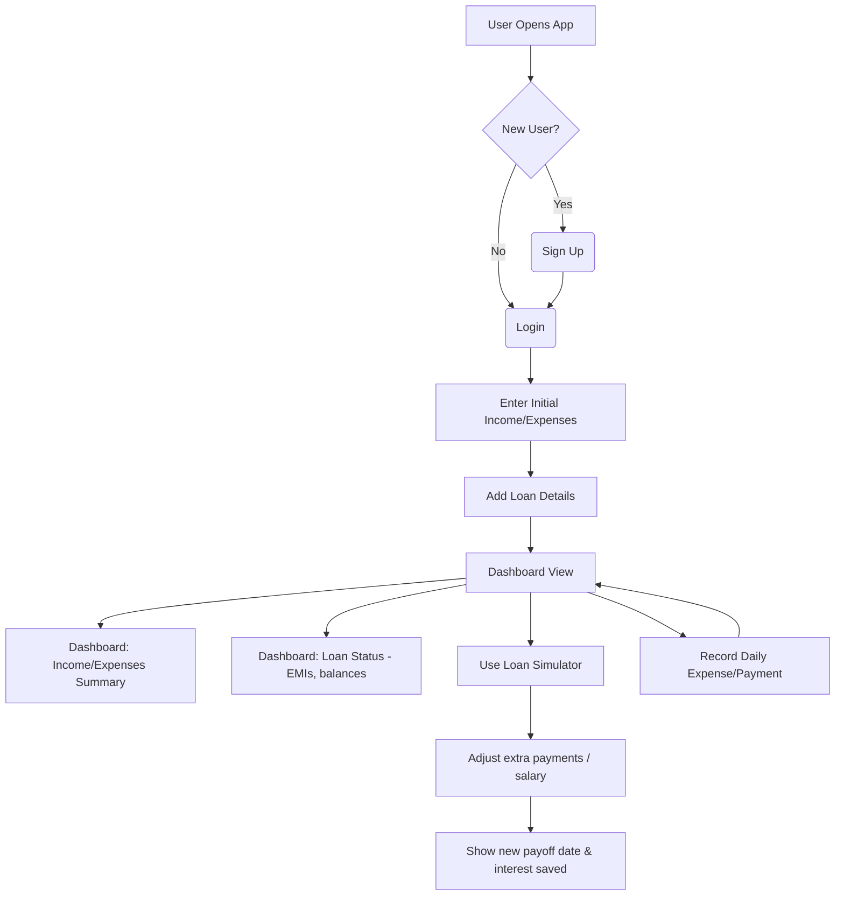
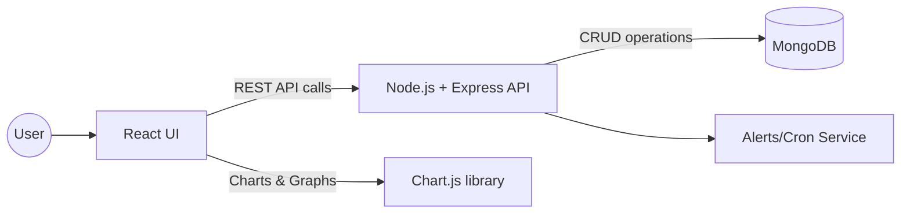
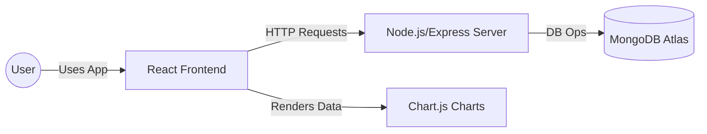
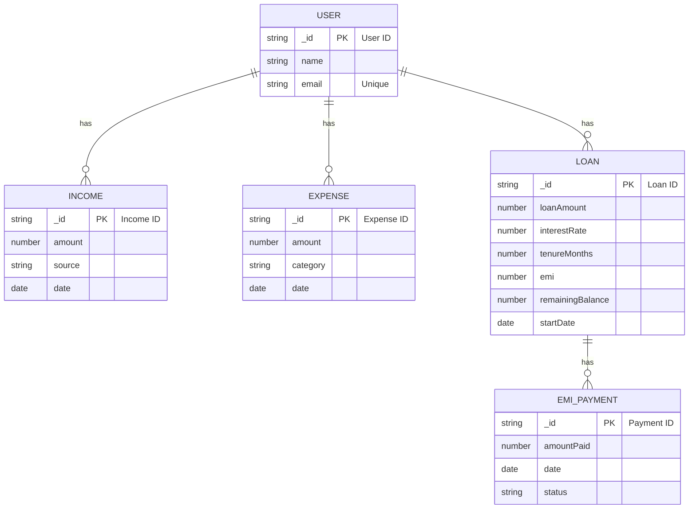

# 🚀 Countdown — Smart Loan Payoff Dashboard

 

> **Executive Summary:** *Countdown* is a full-stack financial dashboard focused on **loan payoff**. It lets users track incomes and expenses, calculate and manage loans, and see a "countdown" of their debt over time. The app provides a consolidated dashboard of cash flow (income vs. expenses) and loan progress, along with smart insights (EMI calculations, interest breakdown, and a custom loan health score). With interactive simulations (extra payments, salary changes) and alerts, Countdown helps users make informed decisions to **become debt-free faster**.

Countdown addresses a common pain point: people often lose track of spending and aren't sure how extra payments affect their loans. By integrating all financial data and automating complex calculations (like EMIs and amortization), Countdown brings clarity and control. It's ideal for students or professionals with loans who want an intuitive, data-driven approach to budgeting and debt management.

**Target Users:** Individuals (students, young professionals, families) with one or more loans who need to manage budgets and plan loan repayment. Also useful for personal finance enthusiasts who want advanced visualizations and simulations of their debt.

**Tech Stack:** React (frontend) with Chart.js for visualizations, Node.js/Express (backend), and MongoDB (database).

---

## 📑 Table of Contents

- [Project Overview](#-project-overview)
- [Problem Statement](#-problem-statement)
- [Key Features](#-key-features)
- [User Flow](#-user-flow)
- [System Architecture](#-system-architecture)
- [Database Schema](#️-database-schema)
- [API Endpoints](#-api-endpoints)
- [Core Business Logic](#-core-business-logic)
- [Frontend Structure](#-frontend-structure-react)
- [Backend Architecture](#️-backend-architecture)
- [Testing Plan](#-testing-plan)
- [Deployment Guide](#-deployment-guide)
- [Security & Privacy](#-security--privacy)
- [Analytics & Metrics](#-analytics--metrics)
- [Roadmap & Monetization](#-roadmap--monetization)
- [Contributing](#-contributing)
- [License](#-license)

---

## 🎯 Project Overview

Countdown combines traditional budget tracking with **loan optimization**. Key modules:

- **Income & Expense Tracker:** Record all income sources and categorized expenses. Visual charts (bar, pie) show where money goes.
- **Loan Manager:** Enter loan details (amount, interest rate, tenure). Countdown auto-calculates the EMI (Equated Monthly Installment). As payments are logged, it updates the remaining balance and interest breakdown.
- **Dashboard & Visuals:** The home dashboard summarizes total income, expenses, net savings, and all loan balances. Includes an interactive pie chart of expense categories, line graphs of monthly spending/income, and a gauge/bar for debt remaining.
- **Loan Simulator:** Countdown's core USP. Users can experiment with extra monthly payments or salary increases. The simulator recalculates an accelerated payoff schedule and shows the new payoff date and interest saved. For example: *"If you pay $100 extra per month, your 5-year loan finishes 1 year early."*
- **Alerts & Insights:** Smart notifications warn of upcoming EMI due dates and overspending. Example: *"You're spending 40% of income on dining; cutting $50 here each month could save $600/year."*

The product positions itself as more than an expense tracker — it's a **financial planning tool**, focusing especially on **debt reduction**.

---

## 💡 Problem Statement

Many borrowers use static spreadsheets or banking apps that don't highlight debt strategy. Common problems:

- **Lack of awareness:** People often don't know their exact spending breakdown or the interest portion of loan payments.
- **Complex calculations:** Calculating EMI and amortization by hand is error-prone. Users need clear, automated formulas.
- **No "what-if" planning:** Without simulation tools, users can't easily see how extra payments change their payoff timeline.
- **Delayed actions:** No reminders lead to missed payments or ignored budget overruns.

**Countdown solves these** by unifying financial data and providing actionable insights. It answers questions like *"How much faster can I pay off this loan?"* and *"What's my daily/weekly spending limit to meet my goals?"*

---

## ⭐ Key Features

### MVP (Minimal Viable Product)

- **User Authentication:** Secure signup/login with email & password; JWT-based sessions.
- **Dashboard:** Overview page showing total income, total expenses, net savings, loan summary (total debt, paid vs remaining), and visual charts.
- **Income & Expenses:**
  - Add, edit, delete income sources (fields: amount, source, date).
  - Add, edit, delete expenses (fields: amount, category, date).
  - Categorization: Food, Rent, Utilities, etc.
- **Loan Management:**
  - Add loans (fields: principal, annual interest rate, tenure in years, start date).
  - Auto-compute monthly EMI.
  - Display loan details: EMI amount, total payable, remaining balance, end date.
  - Mark EMI payments (date, amount); update remaining balance accordingly.
- **Basic Alerts:**
  - EMI due reminders (e.g. *"EMI of $X due in 3 days"*).
  - Budget threshold alerts (e.g. *"You've spent 90% of your budget on dining"*).

### Advanced Features (Future/Premium)

- **Loan Simulator (Core):** Input extra payment amounts or one-time payments. Recompute new payoff schedule showing new remaining term and total interest saved.
- **Loan Health Score:** Custom score (0–100) indicating financial risk based on debt-to-income ratio, expense ratio, etc. Simple rating: 🟢 Safe, 🟡 Caution, 🔴 Risk.
- **AI-Powered Suggestions:** ML or heuristics to suggest budget optimizations.
- **Reporting:** Export financial summary or loan schedules as PDF/CSV.
- **Bank Integrations (Optional):** Connect accounts via APIs like Plaid to auto-import transactions.
- **Multi-Currency / Investment Tracking:** Conversions, stock tracking.
- **Mobile App:** PWA or React Native for iOS/Android.

---

## 🧑‍💻 User Flow

1. **Onboarding:** Signup/Login.
2. **Initial Setup:** Enter monthly income and fixed expenses (rent, bills).
3. **Add Loans:** Input each loan's details (amount, rate, tenure). Countdown shows EMI and schedule.
4. **Daily Use:** Record any expense or additional payment. Check dashboard metrics.
5. **Review Dashboard:** Monitor summary and charts.
6. **Run Simulations:** Adjust sliders for extra payments or salary increments; view impact.
7. **Receive Alerts:** Notifications prompt timely EMI payments or highlight overspending.





---

## 📊 System Architecture

Countdown uses a typical MERN architecture:

- **Client (React):** Single-page application. Uses React Router for pages (Dashboard, Income, Expenses, Loans, Simulator, Profile). Fetches data from APIs. Chart.js is embedded via `react-chartjs-2` for rendering charts.

- **Server (Node.js + Express):** Exposes RESTful API endpoints (e.g. `/api/loans`, `/api/emi/pay`). Implements business logic including EMI and amortization calculations, loan simulation algorithms, loan health scoring, user authentication/authorization (JWT tokens), and scheduled tasks (via `node-cron`) for sending reminder emails or push notifications.

- **Database (MongoDB):** Document database (hosted on MongoDB Atlas or self-managed). Stores collections for users, incomes, expenses, loans, and EMI payments. MongoDB's flexible schema fits well for this evolving data model.

- **Deployment:** Separate hosting for frontend (e.g. Vercel/Netlify) and backend (Heroku/Render). Environment variables manage secrets (DB URL, JWT secret). CI/CD pipelines (GitHub Actions) handle automated testing and deployment.



---

## 🗄️ Database Schema

| Collection | Field | Type | Description | Indexes |
|---|---|---|---|---|
| **Users** | `_id` | ObjectId | Primary key (auto-generated) | `_id` (PK) |
| | `name` | String | Full name | — |
| | `email` | String | Email (login; unique) | Unique index |
| | `passwordHash` | String | Hashed password (bcrypt) | — |
| | `createdAt` | Date | Timestamp of account creation | — |
| **Income** | `_id` | ObjectId | Record ID | `_id` (PK) |
| | `userId` | ObjectId | Ref to Users._id | Index |
| | `amount` | Number | Income amount (positive) | — |
| | `source` | String | Description (e.g. "Salary") | — |
| | `date` | Date | Date received | — |
| **Expenses** | `_id` | ObjectId | Record ID | `_id` (PK) |
| | `userId` | ObjectId | Ref to Users._id | Index |
| | `amount` | Number | Expense amount | — |
| | `category` | String | Category (Food, Rent, Travel, etc.) | — |
| | `date` | Date | Date of spending | — |
| **Loans** | `_id` | ObjectId | Loan ID | `_id` (PK) |
| | `userId` | ObjectId | Ref to Users._id | Index |
| | `loanAmount` | Number | Original principal | — |
| | `interestRate` | Number | Annual interest rate (%) | — |
| | `tenureMonths` | Number | Loan term in months | — |
| | `emi` | Number | Calculated monthly EMI | — |
| | `remainingBalance` | Number | Current principal remaining | — |
| | `startDate` | Date | Loan start date | — |
| **EMI_Payments** | `_id` | ObjectId | Payment ID | `_id` (PK) |
| | `loanId` | ObjectId | Ref to Loans._id | Index |
| | `amountPaid` | Number | Amount paid in this installment | — |
| | `date` | Date | Payment date | — |
| | `status` | String | "paid" or "pending" | — |

- Foreign keys (`userId`, `loanId`) are indexed for fast lookups.
- `_id` is automatically indexed (primary key). Email has a unique index to prevent duplicates.



---

## 📡 API Endpoints

All endpoints require authentication (JWT) except `/signup` and `/login`.

| Method | Endpoint | Description | Auth | Request Body Example |
|---|---|---|---|---|
| POST | `/api/signup` | Register a new user | No | `{ "name": "Alice", "email": "a@b.com", "password": "secret" }` |
| POST | `/api/login` | User login | No | `{ "email": "a@b.com", "password": "secret" }` |
| GET | `/api/income` | Get all incomes for user | Yes | — |
| POST | `/api/income` | Add a new income record | Yes | `{ "amount":5000, "source":"Job", "date":"2023-03-01" }` |
| GET | `/api/expense` | Get all expenses for user | Yes | — |
| POST | `/api/expense` | Add a new expense record | Yes | `{ "amount":200, "category":"Food", "date":"2023-03-02" }` |
| GET | `/api/loan` | Get all loans for user | Yes | — |
| POST | `/api/loan` | Create a new loan | Yes | `{ "loanAmount":10000, "interestRate":8, "tenureMonths":60, "startDate":"2024-01-01" }` |
| GET | `/api/loan/:loanId` | Get details of a single loan | Yes | — |
| POST | `/api/loan/:loanId/pay` | Record a loan payment (EMI) | Yes | `{ "amountPaid":205.43, "date":"2024-02-01" }` |
| GET | `/api/loan/:loanId/emi` | Get EMI payment history for loan | Yes | — |

**Example (cURL):**

```bash
# Add a new loan
curl -X POST https://api.countdown.com/api/loan \
  -H "Authorization: Bearer <token>" \
  -H "Content-Type: application/json" \
  -d '{"loanAmount":5000,"interestRate":5,"tenureMonths":24,"startDate":"2024-01-01"}'
```

**Sample Response:**

```json
{
  "_id": "640ab12c4f1b2a001b123456",
  "loanAmount": 5000,
  "interestRate": 5,
  "tenureMonths": 24,
  "emi": 219.36,
  "remainingBalance": 5000,
  "startDate": "2024-01-01T00:00:00.000Z"
}
```

Endpoints use standard HTTP status codes: `200` for success, `201` for creation, `400` for bad input, `401` for unauthorized.

---

## 🧮 Core Business Logic

### EMI Calculation

The **Equated Monthly Installment (EMI)** for a fixed-rate loan:

$$\text{EMI} = \frac{P \times r \times (1 + r)^{n}}{(1 + r)^{n} - 1}$$

Where:
- `P` = Principal (loan amount)
- `r` = Monthly interest rate (annual rate ÷ 12 ÷ 100)
- `n` = Total number of monthly payments

```javascript
function calculateEMI(principal, annualRate, tenureMonths) {
  const r = (annualRate / 100) / 12;
  const n = tenureMonths;
  const emi = (principal * r * Math.pow(1 + r, n)) /
              (Math.pow(1 + r, n) - 1);
  return Math.round(emi * 100) / 100;
}
```

### Amortization Algorithm

Each EMI payment is split into interest and principal using the **reducing-balance** method:

```javascript
function amortizationSchedule(principal, annualRate, months) {
  let balance = principal;
  const monthlyRate = (annualRate / 100) / 12;
  const emi = calculateEMI(principal, annualRate, months);
  const schedule = [];
  for (let i = 1; i <= months && balance > 0.01; i++) {
    const interest = balance * monthlyRate;
    const principalPaid = emi - interest;
    balance -= principalPaid;
    schedule.push({
      month: i,
      principalPaid: Math.round(principalPaid * 100) / 100,
      interestPaid: Math.round(interest * 100) / 100,
      remainingBalance: Math.round(balance * 100) / 100
    });
  }
  return schedule;
}
```

### Loan Payment Processing

When a user logs an EMI payment (`/loan/:id/pay`):

```javascript
app.post('/api/loan/:loanId/pay', authMiddleware, async (req, res) => {
  const loan = await Loan.findById(req.params.loanId);
  const { amountPaid, date } = req.body;
  const monthlyRate = loan.interestRate / 100 / 12;
  const interest = loan.remainingBalance * monthlyRate;
  const principalPaid = amountPaid - interest;
  loan.remainingBalance -= principalPaid;
  await loan.save();
  await EmiPayment.create({ loanId: loan._id, amountPaid, date, status: "paid" });
  res.json({ newBalance: loan.remainingBalance, interestPaid: interest });
});
```

### Extra-Payment Simulator

```javascript
function simulateExtraPayment(principal, annualRate, months, extraPayment) {
  let balance = principal;
  const monthlyRate = (annualRate / 100) / 12;
  const baseEmi = calculateEMI(principal, annualRate, months);
  let month = 0, totalInterest = 0;
  while (balance > 0.01) {
    month++;
    const interest = balance * monthlyRate;
    let payment = baseEmi + extraPayment;
    if (payment > balance + interest) payment = balance + interest;
    balance -= (payment - interest);
    totalInterest += interest;
    if (month > 1000) break;
  }
  return {
    payoffMonths: month,
    interestTotal: Math.round(totalInterest * 100) / 100
  };
}
```

### Loan Health Score

A custom score (0–100) rating the user's financial position:

$$\text{Score} = 100 - \left(50 \times \frac{\text{Total EMI}}{\text{Income}}\right) - \left(30 \times \frac{\text{Expenses}}{\text{Income}}\right)$$

```javascript
function calculateHealthScore(monthlyIncome, totalEmi, totalExpenses) {
  if (monthlyIncome <= 0) return 0;
  let score = 100;
  score -= (50 * totalEmi / monthlyIncome);
  score -= (30 * totalExpenses / monthlyIncome);
  return Math.max(0, Math.round(score));
}
```

---

## 🎨 Frontend Structure (React)

```
- App.js (Router, AuthContext, FinanceContext)
  - DashboardPage
    - SummaryCard (Income, Expense, Loan Balance)
    - ExpenseChart (Chart.js doughnut)
    - IncomeChart (Chart.js line)
    - LoanProgress (progress bar)
    - HealthBadge (score)
  - IncomePage
    - IncomeForm
    - IncomeList
  - ExpensePage
    - ExpenseForm
    - ExpenseList
  - LoansPage
    - LoanForm
    - LoanList
  - LoanDetailPage
    - LoanSchedule (amortization table)
    - PaymentHistory
    - SimulateButton
  - SimulatorPage
    - SimulatorForm
    - SimulatorResults
  - AuthPage (Login/Signup)
```

**State Management** uses React Context or Redux. `FinanceContext` holds state arrays (`incomes`, `expenses`, `loans`, `payments`). Data is fetched via API on load and updated via context.

```javascript
const FinanceContext = createContext();
function FinanceProvider({ children }) {
  const [incomes, setIncomes] = useState([]);
  useEffect(() => { /* fetch /api/income */ }, []);
  return (
    <FinanceContext.Provider value={{ incomes, setIncomes }}>
      {children}
    </FinanceContext.Provider>
  );
}
```

---

## ⚙️ Backend Architecture

The backend follows a **3-layer pattern** (Routes → Controllers → Services/Models):

- **Routes:** `authRoutes.js`, `incomeRoutes.js`, `expenseRoutes.js`, `loanRoutes.js`
- **Services:** `loanService.js` (EMI calc, amortization, simulation), `notificationService.js` (emails/SMS)
- **Authentication:** JWT — on login, sign a token with `jwt.sign({userId}, JWT_SECRET)`. A middleware checks the `Authorization` header on protected routes.
- **Cron Jobs (Alerts):** Use `node-cron` for scheduled reminders:

```javascript
cron.schedule('0 8 * * *', async () => {
  const upcoming = new Date();
  upcoming.setDate(upcoming.getDate() + 3);
  const dueLoans = await Loan.find({ nextPaymentDate: { $eq: upcoming } });
  dueLoans.forEach(loan => sendEmail(loan.userId, "EMI due soon", "Your EMI is due in 3 days."));
});
```

Security best practices applied: input validation (`express-validator`), JWT auth, `helmet`, and rate limiting.

---

## 🧪 Testing Plan

**Unit Tests (Jest or Mocha):**

```javascript
test('EMI formula matches known value', () => {
  const emi = calculateEMI(100000, 12, 12);
  expect(emi).toBeCloseTo(8885.36, 2);
});
```

**Integration Tests (Jest + Supertest):**

```javascript
describe('Loan API', () => {
  it('should create and pay a loan', async () => {
    const res1 = await request(app).post('/api/loan')
      .set('Authorization', `Bearer ${token}`)
      .send({ loanAmount: 1000, interestRate: 10, tenureMonths: 10, startDate: '2025-01-01' });
    expect(res1.status).toBe(201);

    const res2 = await request(app).post(`/api/loan/${res1.body._id}/pay`)
      .set('Authorization', `Bearer ${token}`)
      .send({ amountPaid: 20, date: '2025-02-01' });
    expect(res2.status).toBe(200);
    expect(res2.body).toHaveProperty('newBalance');
  });
});
```

**End-to-End (Cypress or Playwright):** Simulate full user flow — signup, add income, add expense, add loan, record payment, run simulation.

**Target coverage:** >80%. CI pipeline runs tests on every PR via GitHub Actions.

---

## 🚀 Deployment Guide

### Environment Variables

Create a `.env` file:

```env
MONGO_URI=<MongoDB connection string>
JWT_SECRET=<a strong secret>
PORT=5000
EMAIL_HOST=<SMTP host>
EMAIL_USER=<SMTP user>
EMAIL_PASS=<SMTP password>
```

### Local Setup

```bash
# Clone project
git clone https://github.com/yourusername/countdown.git
cd countdown

# Setup backend
cd server
npm install
npm run dev   # starts server on PORT 5000

# Setup frontend
cd ../client
npm install
npm start     # starts React dev server
```

### Docker

```dockerfile
FROM node:18-alpine
WORKDIR /app
COPY package*.json ./
RUN npm install --production
COPY . .
CMD ["node", "app.js"]
```

**Docker Compose:**

```yaml
version: '3'
services:
  backend:
    build: .
    ports:
      - "5000:5000"
    environment:
      - MONGO_URI=mongodb://mongo:27017/countdown
      - JWT_SECRET=devsecret
  mongo:
    image: mongo:6
    volumes:
      - mongo-data:/data/db
volumes:
  mongo-data:
```

Run with `docker-compose up`.

### Hosting

- **Frontend:** Vercel, Netlify, or S3 + CloudFront.
- **Backend:** Heroku, AWS Elastic Beanstalk, Google App Engine, or Docker on DigitalOcean.
- **Database:** MongoDB Atlas (cloud).

---

## 🔒 Security & Privacy

- **Authentication:** JWT with bcrypt-hashed passwords. No plain-text credentials.
- **HTTPS:** Use TLS in production to encrypt data in transit.
- **Input Validation:** Use `express-validator` to sanitize API inputs.
- **Rate Limiting:** Protect auth endpoints from brute-force with `express-rate-limit`.
- **Secrets Management:** Never commit secrets; use environment variables.
- **Data Privacy:** Only store necessary data; mask or encrypt sensitive fields.
- **GDPR/Compliance:** Allow data export/deletion for EU users; maintain a privacy policy.
- **Dependencies:** Keep libraries up-to-date and monitor security advisories.

---

## 📈 Analytics & Metrics

- **User Metrics:** Active users, sign-ups per month, retention rate.
- **Loan Metrics:** Average time to payoff, average debt-to-income ratio across users.
- **Feature Usage:** How often Loan Simulator is used, common extra payment amounts.
- **Error & Performance:** Track API response times, error rates (Sentry, New Relic).
- **Frontend Analytics:** Google Analytics or Plausible for page views and conversion funnels.

---

## 🔮 Roadmap & Monetization

### Future Enhancements

- **Mobile App:** React Native or Flutter app for iOS/Android.
- **Bank Integrations:** Plaid/Yodlee APIs to auto-sync transactions.
- **Investment Tracking:** Stocks, crypto — net worth and interest income.
- **AI Advisor:** Advanced budget optimization (ChatGPT-like models).
- **Social/Community:** Allow users to optionally share goals or tips.

### Monetization Options

- **Freemium Model:** Basic features free; premium subscription unlocks advanced analytics and AI insights.
- **Affiliate Marketing:** Partner with loan refinance platforms, earning referral fees.
- **Paid Support/Consulting:** Offer financial planning services through the app.

---

## 📜 Contributing

We welcome contributions!

1. **Fork & Clone:** `git clone https://github.com/yourusername/countdown.git`
2. **Branch:** `git checkout -b feature/my-feature`
3. **Code:** Follow existing code style (JS/React frontend, Express/Mongoose backend).
4. **Test:** Add tests for new functionality and ensure all tests pass locally.
5. **Commit & PR:** Commit with a descriptive message and open a Pull Request against `main`.
6. **Review:** Address feedback — we'll review and merge.

See [CONTRIBUTING.md](CONTRIBUTING.md) for more details.

---

## 📜 License

Countdown is released under the **MIT License**. See [LICENSE](LICENSE) for full text.
